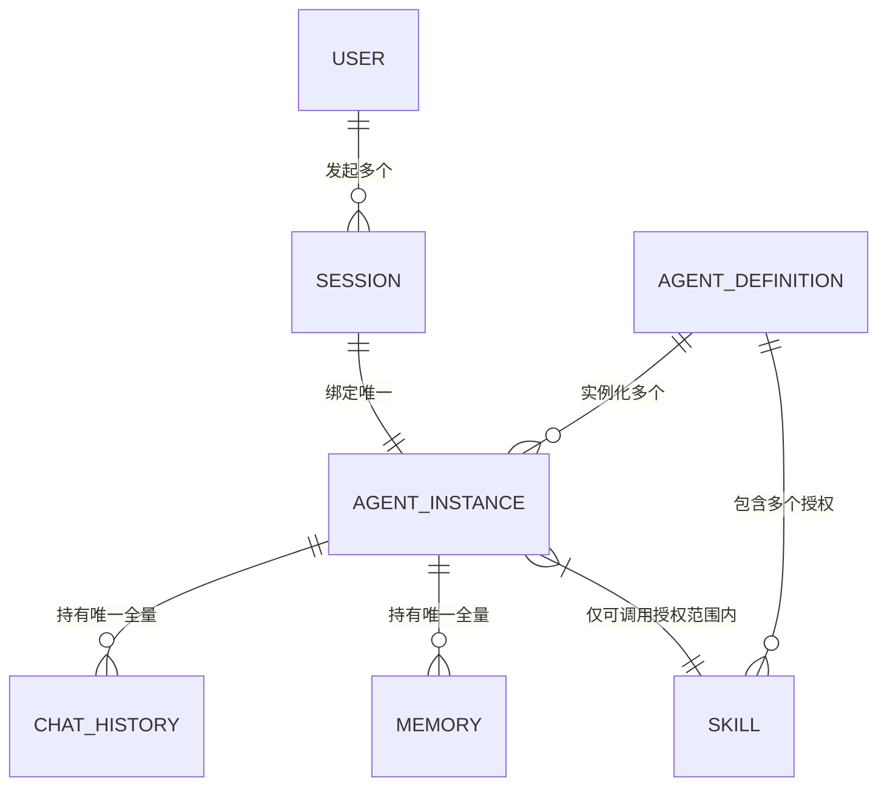

# OWL Agent 概念设计（Conceptual Design）
## 一、概念设计定位
本概念设计是OWL Agent项目的**顶层共识与底层逻辑锚点**，是后续架构设计、技术实现、产品迭代的统一语言与核心边界。它不涉及具体技术实现、代码开发、部署方案，仅聚焦于回答「OWL Agent到底是什么、核心解决什么问题、核心构成要素是什么、要素间遵循什么规则」这几个本源问题。

## 二、设计愿景与核心解决痛点
### 2.1 设计愿景
打造一套**定义标准化、实例隔离化、能力可复用、记忆私有化**的智能体（Agent）概念体系，实现「一份智能体标准定义，可安全、无串扰地服务海量用户，每个用户拥有独立的对话上下文与专属记忆」的核心目标。

### 2.2 核心解决痛点
1.  **角色与数据强耦合**：传统智能体将角色设定、对话数据、用户记忆绑定在一起，修改智能体角色会影响所有历史对话与用户数据，无法实现能力复用。
2.  **多用户记忆串扰**：单套智能体定义面向多用户服务时，无法实现用户间对话历史、记忆数据的严格隔离，出现信息泄露、上下文混乱的问题。
3.  **能力与状态边界模糊**：无法清晰区分智能体「可共享的通用能力」与「用户私有的状态数据」，导致智能体迭代、扩容、运维难度指数级上升。
4.  **会话与记忆管理混乱**：无法支持同一用户多会话场景下的记忆统一管理，也无法实现跨会话的长期记忆沉淀，智能体无法形成对用户的持续认知。

## 三、核心设计理念
本概念设计的所有规则与要素，均围绕以下4条核心理念构建，是整个体系的底层逻辑：
1.  **模板与实例二元分离**：智能体的标准化定义（模板）与面向用户的运行实体（实例）完全解耦，模板全局共享，实例按用户独立创建。
2.  **能力共享，状态私有**：智能体的通用能力、角色规则、工具技能是全局可复用的共享资源；用户的对话历史、记忆数据、会话状态是用户专属的私有资源，二者严格拆分。
3.  **用户-会话-实例强绑定**：一个智能体运行实例，唯一归属于一个用户、一个会话，是用户私有数据的唯一载体，实现天然的数据隔离。
4.  **记忆归属唯一，分层管理**：所有记忆、对话数据的唯一归属主体是智能体实例，而非智能体定义；同时支持记忆分层，适配不同场景的上下文与认知沉淀需求。

## 四、核心概念术语与精确定义
以下是OWL Agent体系内的核心概念，每个概念均有唯一、无歧义的定义、核心职责与边界约束，是整个体系的基础构成单元。

### 4.1 智能体定义（Agent Definition）
**定义**：智能体的标准化元模板、静态蓝图，是对一类智能体的角色、能力、行为规则的完整、无差别的描述，不与任何用户、会话绑定，不存储任何用户相关的状态数据。
**核心职责**：
- 定义智能体的核心身份、角色定位、行为准则与系统提示规则
- 定义智能体可使用的技能/工具范围、调用规则
- 定义智能体的基础运行参数、输出规范、约束边界
- 作为智能体实例化的唯一标准模板，保障同类型智能体的能力一致性
  **边界约束**：
- 不持有任何用户专属的对话数据、记忆数据、会话状态
- 一份定义可无限次实例化，生成多个独立的智能体实例
- 定义的迭代更新，不直接影响已生成的运行实例

### 4.2 智能体实例（Agent Instance）
**定义**：由智能体定义实例化生成的、面向用户的运行时实体，是用户与智能体交互的唯一窗口，也是用户专属对话历史、记忆数据、会话状态的唯一合法载体。
**核心职责**：
- 基于所属的智能体定义，承接用户的交互请求，完成推理、工具调用、响应生成
- 管理所属用户、所属会话的全量对话历史
- 管理所属用户的分层记忆，实现上下文感知与用户认知沉淀
- 隔离不同用户、不同会话的数据，确保交互过程无串扰、无泄露
  **边界约束**：
- 一个实例，唯一归属于「一个智能体定义 + 一个用户 + 一个会话」
- 实例之间完全独立，数据互不互通、状态互不干扰
- 实例仅能调用所属智能体定义中授权的技能/工具
- 实例的生命周期与会话生命周期关联，可支持跨会话的记忆持久化

### 4.3 用户（User）
**定义**：智能体服务的使用主体，是智能体实例、会话、私有数据的所有权人。
**核心职责**：
- 发起会话，触发智能体实例的创建与运行
- 与智能体实例交互，提供输入、接收响应
- 拥有自身所有会话对应的智能体实例、对话历史、记忆数据的所有权
  **边界约束**：
- 一个用户可同时发起多个会话，对应生成多个独立的智能体实例
- 用户仅能访问、管理自身所属的智能体实例与相关数据，无权访问其他用户的相关资源

### 4.4 会话（Session）
**定义**：用户与智能体实例之间一次连续交互的生命周期载体，是用户交互请求的上下文边界。
**核心职责**：
- 界定一次连续交互的起止范围，关联唯一的智能体实例
- 为交互过程提供上下文标识，保障对话的连续性
- 管理本次交互的会话状态（如进行中、已结束、已归档）
  **边界约束**：
- 一个会话，唯一绑定一个用户、一个智能体实例
- 会话结束后，对应的对话历史、记忆数据可随智能体实例持久化留存，支持后续回溯与复用
- 不同会话之间，上下文默认隔离，可通过用户授权实现跨会话的记忆共享

### 4.5 对话历史（Chat History）
**定义**：用户与智能体实例在单一会话内，所有交互轮次的结构化记录，是会话上下文的核心载体。
**核心职责**：
- 完整记录会话内每一轮的用户输入、智能体响应、工具调用过程与结果
- 为大模型推理提供连续的上下文支撑，保障多轮对话的连贯性
- 支持会话回溯、审计、上下文截断与总结优化
  **边界约束**：
- 唯一归属于一个智能体实例（对应唯一用户、唯一会话）
- 仅能被所属的智能体实例读取、写入、修改，不可跨实例共享
- 不可脱离所属的智能体实例独立存在

### 4.6 记忆（Memory）
**定义**：智能体实例对用户的认知沉淀，是从对话历史、交互过程中提取的、可跨轮次、跨会话复用的结构化信息，是智能体实现个性化服务的核心。
**核心职责**：
- 存储用户的偏好、习惯、核心需求、关键信息、历史经验等个性化内容
- 为智能体推理提供长期上下文支撑，实现跨会话的个性化感知
- 支持分层管理，适配不同场景的记忆需求
  **核心分层（概念层面）**：
- 短期记忆：单轮/多轮对话内的临时上下文、任务中间结果，随会话结束可清理
- 长期记忆：跨会话持久化留存的用户核心认知，永久归属用户对应的智能体实例
  **边界约束**：
- 唯一归属于一个智能体实例（对应唯一用户）
- 仅能被所属的智能体实例读取、写入、更新，严格隔离
- 不可脱离所属的智能体实例独立存在

### 4.7 技能/工具（Skill/Tool）
**定义**：智能体可调用的、无状态的、可复用的能力单元，是智能体突破大模型本身能力边界，实现外部交互、专业任务处理的核心载体。
**核心职责**：
- 为智能体提供标准化的能力扩展（如信息搜索、数据计算、API调用、文件处理等）
- 定义能力的调用规则、入参规范、出参格式
- 为所有符合授权条件的智能体实例提供统一的能力服务
  **边界约束**：
- 归属于智能体定义，由定义进行授权管理，同一定义下的所有实例共享
- 本身无状态，不存储任何用户专属数据，执行过程中仅能使用调用方实例的上下文与数据
- 实例仅能调用所属智能体定义中已授权的技能/工具

## 五、概念间核心关系与刚性约束规则
### 5.1 核心关系总览

### 5.2 刚性约束规则（概念层面不可突破）
1.  **实例归属唯一性规则**：1个智能体实例，有且仅有1个所属的智能体定义、1个所属用户、1个所属会话，不可多归属。
2.  **数据归属唯一性规则**：对话历史、记忆数据，有且仅有1个所属的智能体实例，不可跨实例归属、不可直接归属智能体定义。
3.  **能力共享规则**：技能/工具仅能归属智能体定义，同一定义下的所有实例，共享该定义授权的全部技能/工具，不可私自扩展未授权能力。
4.  **隔离性规则**：不同用户对应的智能体实例之间，数据、状态、上下文完全隔离，无授权情况下不可互通；同用户不同会话对应的实例之间，上下文默认隔离，仅可通过长期记忆实现授权后的跨会话复用。
5.  **模板不变性规则**：智能体定义的更新迭代，不强制变更已生成的智能体实例，实例可选择沿用原有定义版本，或同步更新至新版本，保障运行稳定性。

## 六、概念层面的核心运行流程
本流程仅描述概念间的协同逻辑，不涉及任何技术实现细节：
1.  体系内先完成智能体定义的创建与发布，明确该智能体的角色、规则、授权技能、运行参数，形成标准化模板。
2.  用户发起一次新的交互，系统为该用户创建一个新的会话。
3.  基于本次会话，系统根据选定的智能体定义，为该用户、该会话生成一个唯一的智能体实例。
4.  用户向该会话发送交互请求，请求唯一传递至对应的智能体实例。
5.  智能体实例基于所属的智能体定义规则，加载本次会话的对话历史、用户专属记忆，完成推理与决策。
6.  推理过程中，智能体实例可调用所属定义授权的技能/工具，完成能力扩展。
7.  智能体实例生成响应结果，返回给用户；同时将本次交互的内容写入对话历史，提取关键信息更新用户记忆。
8.  会话结束后，智能体实例的对话历史、记忆数据持久化留存；用户再次发起同一会话时，复用该实例，延续上下文与记忆；用户发起新会话时，生成新的实例，默认隔离上下文。

## 七、概念边界与适用范围
### 7.1 适用范围
本概念设计覆盖OWL Agent体系的全场景，包括但不限于：
- 单智能体面向多用户的对话交互场景
- 同用户多会话的智能体服务场景
- 带工具调用、长期记忆的个性化智能体场景
- 后续可扩展的多智能体协同场景

### 7.2 不覆盖范围
本概念设计不涉及以下内容，后续由专项设计承接：
- 底层大语言模型的训练、推理、优化逻辑
- 第三方技能/工具的具体实现逻辑
- 具体的技术架构、数据库设计、代码实现方案
- 部署、运维、监控、安全等工程化实现细节

## 八、概念设计核心价值
1.  **统一语言**：为产品、研发、运营等所有项目参与方，提供了无歧义的统一概念体系，避免因认知偏差导致的设计、开发偏差。
2.  **解决核心矛盾**：从本源上解决了「一份智能体定义，多用户服务，记忆严格隔离」的核心问题，为后续技术实现提供了不可动摇的底层逻辑。
3.  **极致可扩展性**：模板与实例的分离、能力与状态的分离，让智能体定义的迭代、用户规模的扩容、能力的扩展完全解耦，支持无限横向扩展。
4.  **数据安全合规**：用户私有数据与智能体公共能力的严格拆分，实例级的数据隔离，天然满足数据隐私、合规的核心要求。
5.  **可复用性**：标准化的智能体定义模板，可实现一次定义、全场景复用，大幅降低智能体的创建、运维成本。