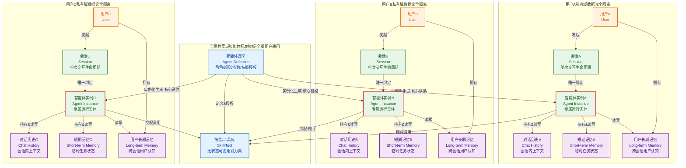
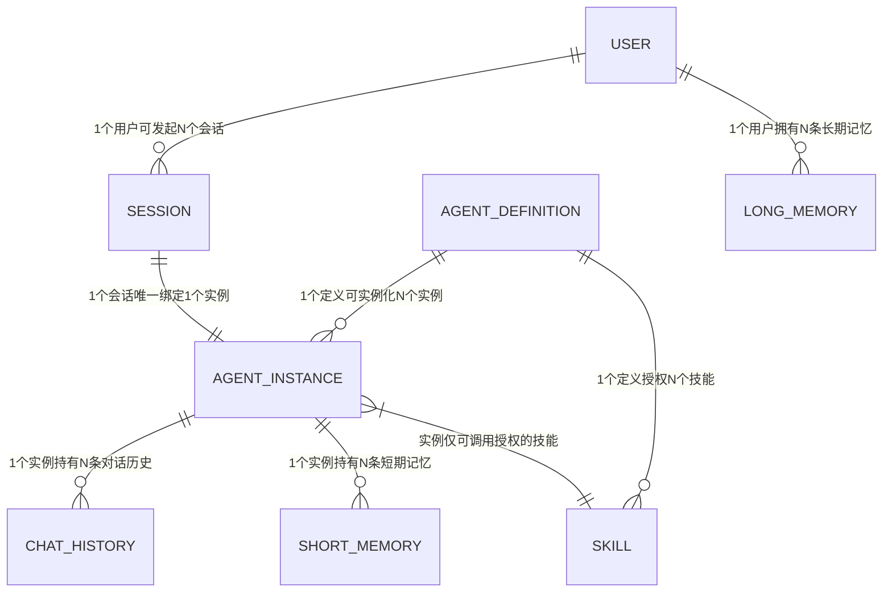
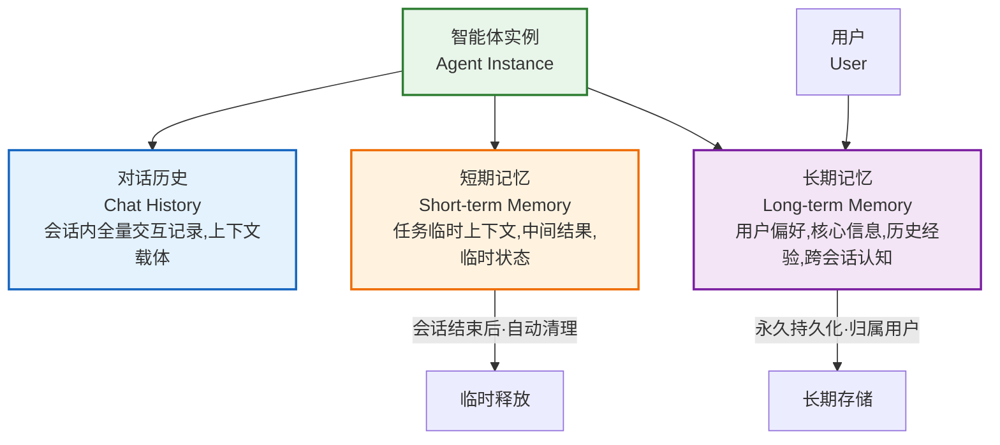
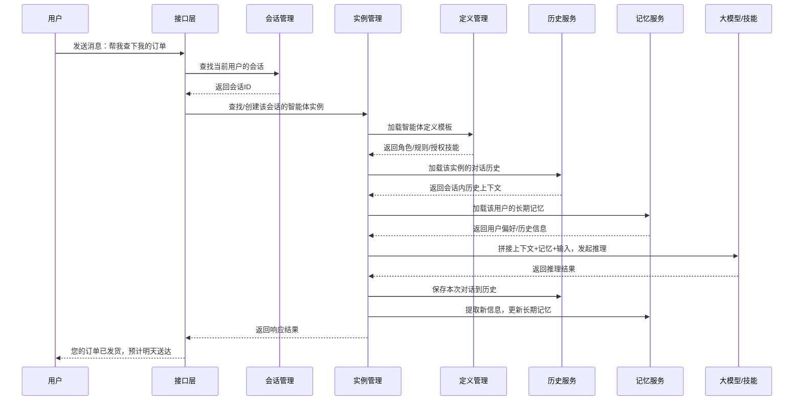
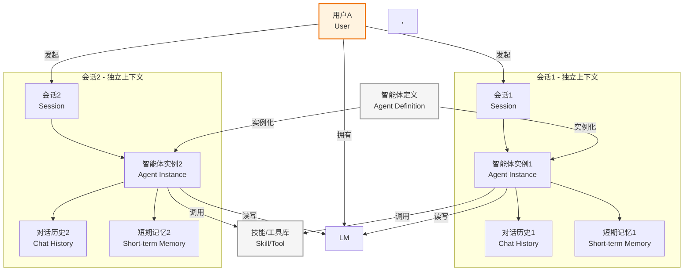
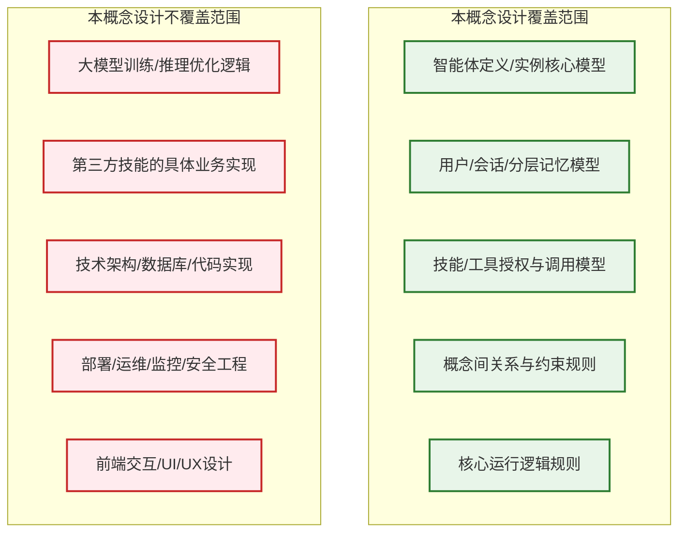

# OWL Agent 完整概念设计文档
**版本：V1.0 | 日期：2026-04-16 | 定位：项目顶层共识文档**

---

## 1. 概念设计定位
本文档是OWL Agent项目的**顶层概念锚点与统一语言规范**，不涉及具体技术实现、代码开发、部署方案，仅聚焦于定义OWL Agent的核心概念、要素关系、运行规则与边界，为后续架构设计、开发实现、产品迭代提供不可动摇的底层逻辑共识，彻底解决「一份智能体定义，多用户服务，记忆严格隔离」的核心痛点。

---

## 2. 设计愿景与核心痛点
### 2.1 设计愿景
打造一套**定义标准化、实例隔离化、能力可复用、记忆私有化**的智能体概念体系，实现「一份智能体标准定义，可安全、无串扰地服务海量用户，每个用户拥有独立的对话上下文与专属记忆，同时支持跨会话的长期认知沉淀」的核心目标。

### 2.2 核心解决痛点
1.  **角色与数据强耦合**：传统智能体将角色设定、对话数据、用户记忆绑定，修改角色会影响所有用户数据，无法实现能力复用
2.  **多用户记忆串扰**：单套智能体定义面向多用户服务时，无法实现用户间数据严格隔离，出现信息泄露、上下文混乱
3.  **能力与状态边界模糊**：无法区分「可共享的通用能力」与「用户私有的状态数据」，导致迭代、扩容、运维难度指数级上升
4.  **多会话管理混乱**：同一用户多会话场景下，无法实现「上下文隔离+长期记忆共享」，要么上下文串扰，要么无法沉淀用户认知

---

## 3. 核心设计理念
本概念设计的所有规则与要素，均围绕以下4条核心理念构建：
1.  **模板与实例二元分离**：智能体的标准化定义（模板）与面向用户的运行实体（实例）完全解耦，模板全局共享，实例按用户/会话独立创建
2.  **能力共享，状态私有**：智能体的通用能力、角色规则、工具技能是全局可复用的共享资源；用户的对话历史、临时状态是会话私有的，长期认知是用户私有的，二者严格拆分
3.  **用户-会话-实例强绑定**：一个智能体运行实例，唯一归属于一个用户、一个会话，是会话私有数据的唯一载体，实现天然的数据隔离
4.  **记忆分层管理**：记忆拆分为「会话级短期记忆」与「用户级长期记忆」，既保障会话上下文隔离，又支持跨会话的用户认知沉淀

---

## 4. 核心概念全景图
本图完整呈现OWL Agent的整体概念架构，直观体现「共享定义、实例隔离、数据私有」的核心逻辑，是整个概念体系的总览。

---

## 5. 核心概念术语定义
以下是OWL Agent体系内的核心概念，每个概念均有唯一、无歧义的定义与边界：

| 概念 | 类型 | 归属 | 核心职责 | 生命周期 |
|---|---|---|---|---|
| 智能体定义 Agent Definition | 静态模板 | 全局共享 | 定义智能体的角色、规则、参数、授权技能，作为实例化的标准模板 | 长期 |
| 技能/工具 Skill/Tool | 能力单元 | 全局共享 | 无状态的可复用能力，如搜索、计算、API调用，所有授权实例共享 | 长期 |
| 用户 User | 服务主体 | 独立主体 | 智能体服务的使用方，是长期记忆的所有权人 | 长期 |
| 会话 Session | 交互窗口 | 用户私有 | 一次连续交互的生命周期载体，界定上下文边界 | 临时/可归档 |
| 智能体实例 Agent Instance | 运行实体 | 会话私有 | 由定义实例化生成的用户专属运行实体，是交互的唯一窗口 | 与会话绑定 |
| 对话历史 Chat History | 状态数据 | 会话私有 | 会话内全量交互记录，为大模型提供会话上下文 | 可持久化 |
| 短期记忆 Short-term Memory | 状态数据 | 会话私有 | 会话内的临时任务状态、中间结果，会话结束后可清理 | 临时 |
| 长期记忆 Long-term Memory | 认知数据 | 用户私有 | 跨会话的用户认知沉淀，如偏好、核心信息、历史经验 | 长期 |

---

## 6. 概念关系与约束模型
本图用ER模型清晰呈现所有概念间的关系，以及刚性约束规则，是后续数据设计的核心依据。

### 刚性约束规则（不可突破）
1.  **实例归属唯一性**：1个智能体实例，唯一归属于1个定义、1个用户、1个会话，不可多归属
2.  **数据隔离规则**：会话级数据（对话历史、短期记忆）仅能被所属实例访问，用户间完全隔离
3.  **能力共享规则**：技能/工具仅归属定义，所有授权实例共享，本身无状态，不存储用户数据
4.  **记忆归属规则**：长期记忆唯一归属用户，仅能被该用户的所有实例访问，不可跨用户共享

---

## 7. 记忆分层概念模型
针对记忆的分层设计，是解决「多会话上下文隔离+跨会话认知沉淀」矛盾的核心，本图清晰呈现两层记忆的定位与生命周期。

### 分层记忆的核心价值
- **短期记忆**：保障单一会话的上下文独立性，不同会话的临时状态互不干扰
- **长期记忆**：实现跨会话的用户认知沉淀，用户无论开多少个会话，智能体都能记住他的偏好、习惯等核心信息
- 完美解决了「多会话既要隔离上下文，又要共享用户认知」的核心矛盾

---

## 8. 核心运行时序流程
本图呈现用户与智能体交互的完整时序流程，清晰展示所有概念的协同逻辑，是理解运行机制的核心。

---

## 9. 多会话场景概念模型
针对同一用户多会话的场景，本图清晰呈现概念的协同逻辑，完美解决同用户多会话的隔离与共享问题。

### 多会话场景的核心规则
1.  **上下文隔离**：两个会话的对话历史、短期记忆完全隔离，用户在会话1聊的内容，不会串到会话2的上下文里
2.  **记忆共享**：两个会话的实例，都可以读写用户的长期记忆，用户在会话1告诉智能体的偏好，在会话2里智能体依然记得
3.  **能力共享**：两个实例都共享同一个智能体定义的技能，能力统一

---

## 10. 概念边界与适用范围
本图清晰界定本概念设计的覆盖范围，明确哪些是本设计定义的，哪些是后续专项设计承接的，避免边界模糊。

---

## 11. 核心价值总结
1.  **统一语言**：为产品、研发、运营提供无歧义的统一概念体系，彻底消除认知偏差
2.  **解决核心矛盾**：从本源上解决了「一份智能体定义，多用户服务，记忆严格隔离」的核心痛点
3.  **极致可扩展性**：模板与实例分离、能力与状态分离，支持无限用户横向扩展，定义迭代不影响运行中实例
4.  **数据安全合规**：用户私有数据与公共能力严格拆分，实例级数据隔离，天然满足隐私合规要求
5.  **多会话完美支持**：分层记忆设计，完美实现「会话上下文隔离+跨会话认知沉淀」，兼顾隔离与个性化
6.  **可复用性**：标准化的智能体定义，一次定义，全场景复用，大幅降低智能体的创建与运维成本